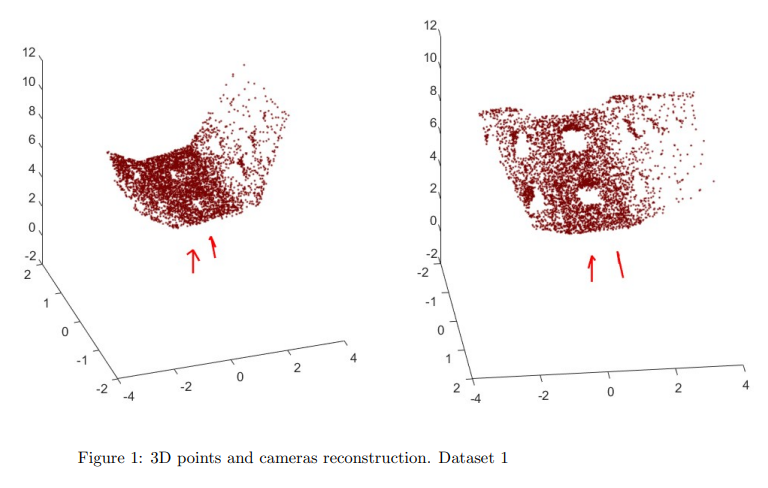
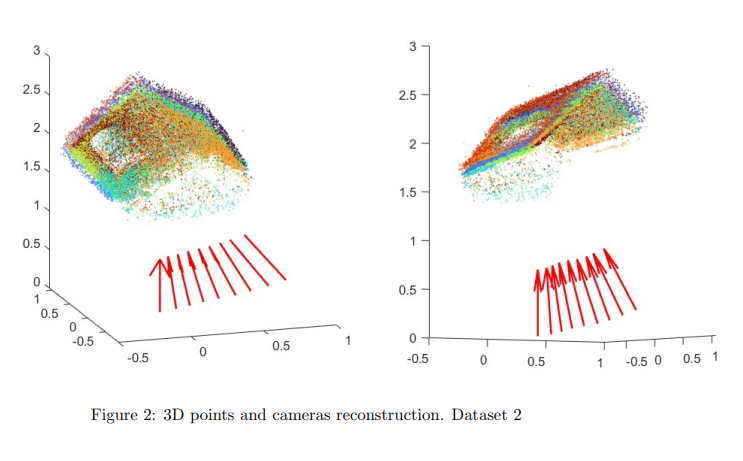

# Structure from motion, 3D reconstruction software

This software performs 3D point cloud recontruction as well as camera positions and orientations based on photos.


# Prerequisites

First you will have to download VLFeat. Go to http://www.vlfeat.org/download.html
and extract the binary package to a directory of your choice and add this folder to matlab path.

# Run software
```matlab
run_sfm(<dataset_number>)
```
Where a <dataset_number> is a number of folder containing phots and camera data in the data folder.

# Example output


